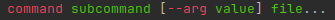

# roff
python-based cli to convert markdown to the roff (man-pages) format


<!-- TOC -->
* [roff](#roff)
  * [Installation](#installation)
  * [Usage/Execution](#usageexecution)
  * [File Format](#file-format)
  * [Example](#example)
<!-- TOC -->

## Installation

[
](https://pypi.org/project/roff/)

```shell
pip install roff
pip install roff[images]  # support for images
pip install roff[images-svg]  # support for svg-images
pip install roff[watch]  # support for rendering and auto-reloading a manpage while writing
```

> [!TIP] 
> After the installation you should be able to see [roff's manpage](https://github.com/utility-toolbox/roff/blob/main/docs/roff.1.md) with `man roff`
> or the file format information with `man roff.5`.

## Usage/Execution

For the common usage you can create a template markdown file with the `roff template` subcommand and then convert it to the roff-file-format with `roff convert`

```shell
roff --help
roff template command.1.md
roff convert command.1.md
man ./command.1
```

Additionally, if `roff[watch]` was installed, you can run `roff watch` to see the rendered file that automatically re-renders if the file-content changes.

```shell
# shell 1
$ roff watch command.1.md
# shell 2
$ nano command.1.md
$ vim command.1.md
```

## File Format

`roff` uses markdown as the file format. It supports all commonmark markdown features (h1 is reserved for the head).

Additionally, roff brings 1 own markdown-feature, the `inline-command`!
By prepending your inline-code with a `$` sign it gets recognised as an inline-command and rendered in a more special way.

```markdown
$`command subcommand [--arg value] file...`
```



> [!TIP]
> Use `roff template command.1.md` to get a pre-filled markdown file as a starting point.

## Example

The following image shows the manpage of roff itself 


